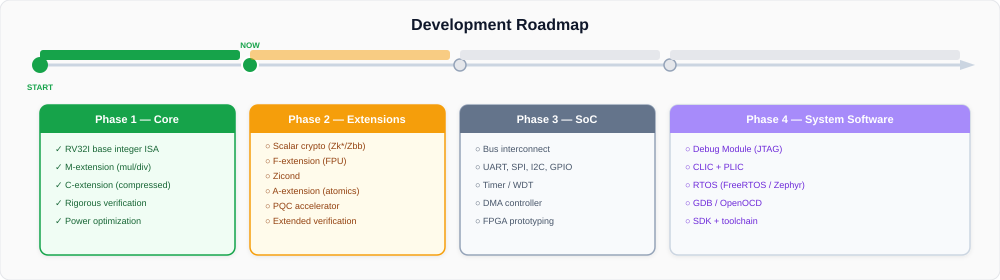
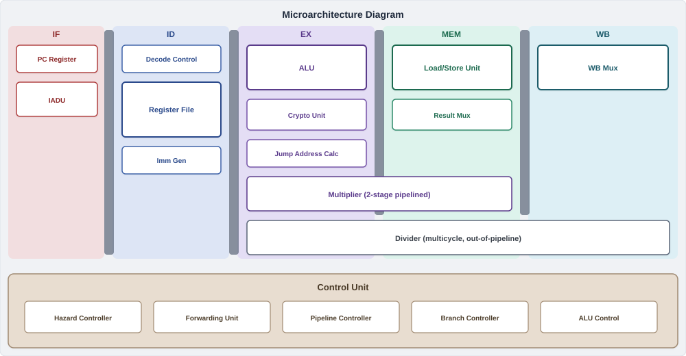
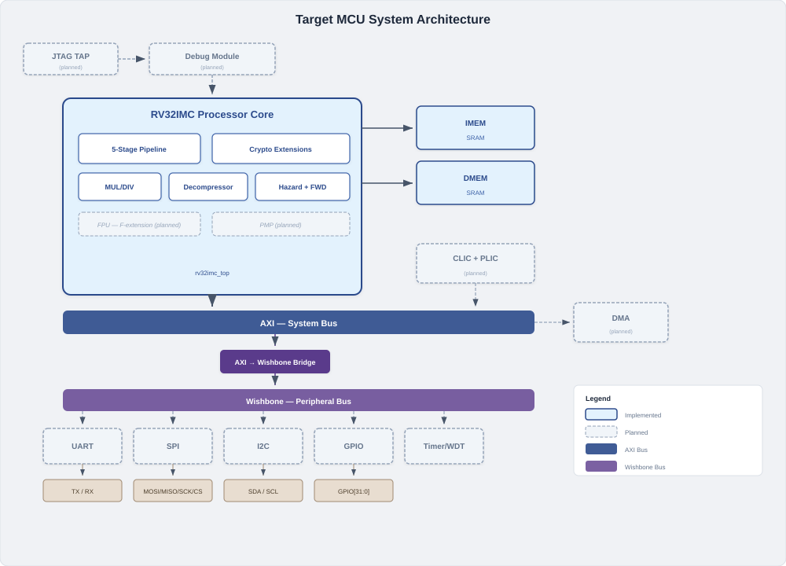

# ChipForge MCU

An open-source RISC-V microcontroller designed through decentralized
competition on [Bittensor Subnet 84 (ChipForge)](https://chipforge.io).

ChipForge MCU is a 32-bit RISC-V processor implementing the **RV32IMC** instruction
set with hardware-accelerated **scalar cryptography** extensions. The core is
built in SystemVerilog and targets low-power edge applications — secure IoT nodes,
TinyML inference, wearables, and smart sensors — where both performance and security
are critical in a small silicon footprint.

### Key Features

| Feature | Description |
|---------|-------------|
| **ISA** | RV32IMC + Zkne + Zknd + Zknh + Zbkb + Zbkc + Zbkx + Zbb |
| **Pipeline** | 5-stage in-order (IF → ID → EX → MEM → WB) |
| **Crypto Acceleration** | AES encrypt/decrypt, SHA-256, carry-less multiply, crossbar permutations |
| **Compressed ISA** | 16-bit C-extension with hardware decompressor (IADU) |
| **Multiply/Divide** | 2-stage pipelined multiplier, multicycle divider |
| **HDL** | SystemVerilog, fully synthesizable |
| **Verification** | Millions of instructions validated against Spike ISA simulator |
| **Functionality** | 100% — every instruction matches the Spike golden reference |

---

## Roadmap

<p align="center">
  
</p>

---

## Architecture

### Processor Core

The processor core is fully implemented — a 5-stage in-order RISC-V pipeline
with a 2-stage pipelined multiplier, multicycle radix-4 divider, and dedicated
crypto execution units for AES, SHA-256, and bit-manipulation. The
microarchitecture is shown below.

<p align="center">
  
</p>

### MCU SoC (Planned)

The end goal is a complete MCU SoC built around the processor core. In the
diagram below, **solid** blocks are implemented and **dashed** blocks are
planned.

<p align="center">
  
</p>

---

## Quick Start

**1. Install Verilator** (if not already installed):
```bash
sudo apt-get install -y git make g++ python3 python3-pip autoconf flex bison help2man
git clone https://github.com/verilator/verilator.git
cd verilator && git checkout v5.038
autoconf && ./configure && make -j$(nproc) && sudo make install
cd ..
```

**2. Install Python dependency:**
```bash
pip3 install pandas
```

**3. Run the full verification suite:**
```bash
cd verif
python3 run_all.py
```

This compiles the design, runs 700 tests (7 suites x 100 iterations), and
reports a pass/fail summary with functionality score and IPC. The build is
incremental — only recompiles when RTL sources change.

---

## Prerequisites

| Tool | Version | Install |
|------|---------|---------|
| **Verilator** | 5.006+ | See [Installing Verilator](#installing-verilator) below |
| **Python 3** | 3.10+ | Comes pre-installed on most systems |
| **GNU Make** | 4.0+ | `sudo apt-get install make` |
| **g++** | 11+ | `sudo apt-get install g++` |
| **pandas** | any | `pip3 install pandas` |

> Verilator 5.006+ is required for `--binary` and `--timing` flags. Check your
> version with `verilator --version`.

### Installing Verilator

**From source** (recommended — installs v5.038):
```bash
sudo apt-get install -y git autoconf g++ flex bison help2man
git clone https://github.com/verilator/verilator.git
cd verilator
git checkout v5.038
autoconf && ./configure && make -j$(nproc)
sudo make install
verilator --version   # should show 5.038
```

**Ubuntu/Debian** (apt — may be older version):
```bash
sudo apt-get install verilator
```

**macOS** (Homebrew):
```bash
brew install verilator
```

---

## Verification

The repository includes a complete, standalone verification environment. All test
stimuli and Spike ISA simulator reference traces are pre-generated — no external
tools beyond Verilator are needed.

### How It Works

<p align="center">
  
</p>

The verification methodology compares the RTL execution trace against a
golden reference from the [Spike](https://github.com/riscv-software-src/riscv-isa-sim)
RISC-V ISA simulator:

1. **Compile** — Verilator compiles the RTL and testbench into a fast C++ simulation binary
2. **Simulate** — Each pre-generated test program (`.mem` files) is loaded and executed
3. **Trace** — An RVFI-based tracer captures every committed instruction and its GPR state changes
4. **Compare** — The core's execution trace is compared instruction-by-instruction against the Spike reference
5. **Report** — A summary is generated with pass/fail counts, functionality score, and IPC

### Running a Single Test

Start with one test suite to verify your setup:

```bash
cd verif
python3 run_all.py --tests riscv_arithmetic_basic_test --iter 1
```

This compiles the design, runs a single iteration of the arithmetic test suite,
and reports the result. You should see:

```
ALL INSTRUCTIONS MATCH - VERIFICATION PASSED
```

### Running a Smoke Test

Run all 7 test suites with 5 iterations each (quick sanity check):

```bash
python3 run_all.py --iter 5
```

### Running the Full Regression

Run the complete test suite — 7 suites, 100 iterations each, 700 total runs:

```bash
python3 run_all.py
```

This takes approximately 15-30 minutes depending on your machine.

### Selecting Specific Test Suites

Run one or more specific test suites:

```bash
# Single suite
python3 run_all.py --tests riscv_aes_test

# Multiple suites
python3 run_all.py --tests riscv_aes_test riscv_sha_test riscv_bitmanip_test

# Multiple suites with limited iterations
python3 run_all.py --tests riscv_crypto_test riscv_aes_test --iter 10
```

### Skipping Recompilation

If you've already compiled and just want to re-run tests:

```bash
python3 run_all.py --skip-build --tests riscv_loop_test
```

### All Options

```
python3 run_all.py [OPTIONS]

  --tests TEST [TEST ...]   Test suites to run (default: all 7)
  --iter N                  Iterations per suite (default: 100)
  --skip-build              Skip Verilator compilation
  --sim-timeout SECONDS     Per-simulation timeout (default: 120)
  --repo-root PATH          MCU repo root (default: auto-detect)
```

### Running Individual Steps

Each stage of the pipeline can be run independently:

```bash
python3 gen_sim.py            # Step 1: Compile RTL + testbench
python3 gen_sim.py --clean    # Step 1: Force full rebuild
python3 run_regression.py     # Step 2: Run tests and compare traces
python3 gen_summary.py        # Step 3: Generate summary from existing results
```

### Test Suites

| Suite | Description | Coverage |
|-------|-------------|----------|
| `riscv_arithmetic_basic_test` | Base integer arithmetic | ADD, SUB, SLT, shifts, logical ops |
| `riscv_mmu_stress_test` | Memory access patterns | Loads, stores, alignment, byte/half/word |
| `riscv_loop_test` | Control flow | Loops, branches, JAL/JALR |
| `riscv_crypto_test` | All scalar crypto | Combined Zk* extension coverage |
| `riscv_aes_test` | AES operations | `aes32esi`, `aes32esmi`, `aes32dsi`, `aes32dsmi` |
| `riscv_sha_test` | SHA-256 acceleration | `sha256sum0/1`, `sha256sig0/1` |
| `riscv_bitmanip_test` | Bit manipulation | `clmul`, `xperm`, `pack`, `brev8`, `zip`/`unzip` |

Each suite contains **100 randomized iterations**, for a total of **700 test runs**.

### Understanding the Output

Results are written to `verif/results/<date>/`:

```
verif/results/2025-12-10/
  regression_summary.csv              # Per-iteration pass/fail
  regression_summary.json             # Aggregated scores
  riscv_arithmetic_basic_test/
    verilator_0.log                   # Simulation stdout
    core_trace_0.log                  # Raw RVFI trace
    core_trace_0.csv                  # Parsed core trace
    spike_trace_0.csv                 # Spike reference trace
    diff_0.log                        # Instruction-by-instruction comparison
    ...
```

The JSON summary:
```json
{
  "total_instr_passed": 3761400,
  "total_instr_failed": 0,
  "functionality_score": 1.0,
  "ipc": 0.58
}
```

- **`functionality_score`**: Fraction of instructions that match Spike (must be `1.0` to pass)
- **`ipc`**: Instructions Per Cycle (performance metric)

---

## Project Structure

```
rtl/                              # Processor RTL (SystemVerilog)
  rv32imc_top.sv                  # Top-level module
  rv32imc.sv                      # Core wrapper
  data_path.sv                    # Datapath (IF/ID/EX/MEM/WB)
  control_unit.sv                 # Main control unit
  decode_control.sv               # Instruction decoder
  alu.sv                          # ALU with Zbb support
  alu_control.sv                  # ALU operation selection
  mul_unit.sv                     # M-extension multiplier (2-stage)
  div_unit.sv                     # M-extension divider (multicycle)
  decompressor.sv                 # C-extension decompressor
  csr_file.sv                     # CSR file (mtvec, mepc, mcause, ...)
  reg_file.sv                     # Register file (32 x 32-bit)
  imm_gen.sv                      # Immediate generator
  lsu.sv                          # Load/store unit
  mem_controller.sv               # Memory controller FSM
  branch_controller.sv            # Branch resolution
  forwarding_unit.sv              # Data hazard forwarding
  hazard_controller.sv            # Hazard detection
  pipeline_controller.sv          # Pipeline flow control
  exception_encoder.sv            # Exception handling
  iadu.sv                         # Instruction address decode unit
  alignment_units.sv              # Address alignment
  core_dbg_fsm.sv                 # Debug FSM
  lib.sv                          # Shared types and primitives
  riscv_types.vh                  # RISC-V type definitions
  crypto/                         # Scalar cryptography
    aes_unit.sv                   # AES (Zkne/Zknd)
    crypto_unit.sv                # Crypto top-level mux
    crypto_bitmanip_lib_optimized.sv  # Zbkb/Zbkc/Zbkx
rtl.f                             # RTL file list

verif/                            # Verification environment
  run_all.py                      # Single entry point
  gen_sim.py                      # Verilator compilation
  run_regression.py               # Test execution + trace comparison
  gen_summary.py                  # Results aggregation
  Makefile                        # Verilator build rules
  tb_top.sv                       # Testbench top module
  imem.sv / dmem.sv               # Memory models
  tracer.sv                       # RVFI execution tracer
  tests/                          # Pre-generated stimuli (7 suites x 100 iter)
  scripts/                        # Trace conversion and comparison
  results/                        # Output (generated at runtime)

docs/
  pipeline_microarchitecture.svg  # Processor pipeline diagram
  mcu_system_architecture.svg     # Target MCU system diagram
  verification_flow.svg           # Verification flow diagram
  roadmap.svg                     # Development roadmap
```

---

## Design History

This core was iteratively designed across five ChipForge challenges:

| Challenge | Milestone |
|-----------|-----------|
| 005 | RV32I base integer core |
| 007 | Added M-extension, compressed instructions, and crypto |
| 008 | Full scalar crypto (Zkne, Zknd, Zknh, Zbkb, Zbkc, Zbkx, Zbb) |
| 009 | Performance and area optimization |
| 010 | Power-aware optimization for edge AI |

### Evaluation Criteria

Designs are scored on a weighted combination of:

- **Functionality** (50%) — must be 100% correct or the design is disqualified
- **Performance** (17-25%) — clock cycles to complete test suite
- **Area** (17-25%) — gate count after synthesis
- **Power** (0-17%) — introduced in Challenge 010

---

## License

TBD
